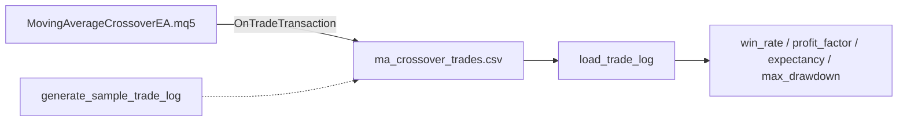

# Architecture

## Why trade logging happens in `OnTradeTransaction`, not at the point of closing

An early version of this EA logged a trade the moment `trade.PositionClose()` was called. That misses every position closed by a stop loss or take profit instead of a crossover signal, and it logs the floating profit at the moment of the close request rather than the deal's actual realized profit. `OnTradeTransaction` fires for every deal MetaTrader actually executes, so filtering for `DEAL_ENTRY_OUT` (a deal that closes a position) catches every closed trade regardless of why it closed, with the real, confirmed profit from trade history — not an approximation.

## Why the log writes to the Common Files folder

`FileOpen(..., FILE_COMMON)` writes to `MQL5\Files\Common`, shared across every terminal installed on the machine, rather than the specific terminal instance's own data folder. The analysis side does not need to know which terminal or which installation path produced the file — it just needs the file.

## Why there is a sample CSV instead of running the EA for real

This environment cannot compile or run MQL5 — that only happens inside the MetaTrader 5 terminal. `analysis/sample_data.py` generates a CSV in the exact schema `OnTradeTransaction` writes, so the Python side can be built, tested, and demonstrated completely honestly, with no claim that the numbers came from a real account. `sample_data/ma_crossover_trades_sample.csv` is the committed output of that generator — a stand-in for what a real export looks like, not a backtest result.

## Why `max_drawdown` is a Polars expression chain, not a Python loop

`cum_max()` over `balance_after`, followed by a drawdown expression against that running peak, computes the same thing a loop would, but as columnar operations Polars can execute without stepping through the DataFrame in Python. For a trade log this size the difference is invisible; the pattern is what matters for anything larger.
